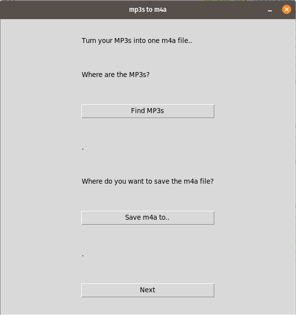
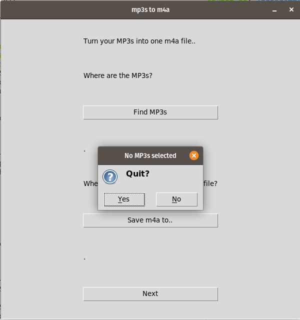
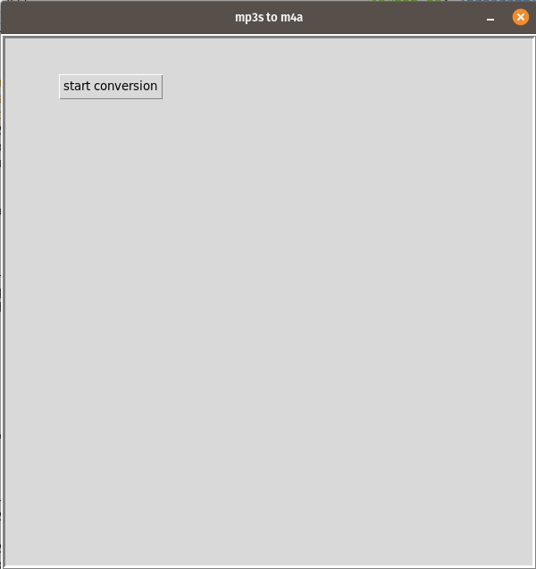
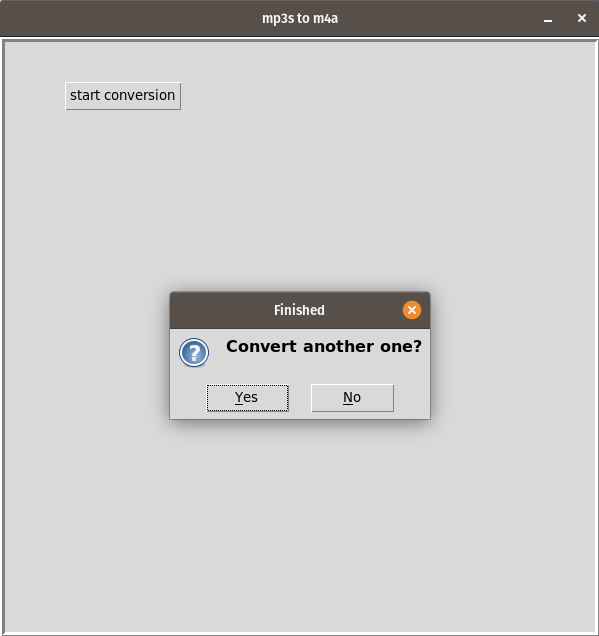

# Introduction

Convert mp3s into one m4a file, including chapters and meta information based on the mp3 files.

I tested it only on Ubuntu.

## Prerequisites
In the background the app uses the following software:
- [FFmpeg](https://www.ffmpeg.org/)
- [Sox](http://sox.sourceforge.net/sox.html)
- [Pysox](https://github.com/rabitt/pysox)

## Running the app
run `python mp3TOm4a.py` in the code folder

## Screenshots

